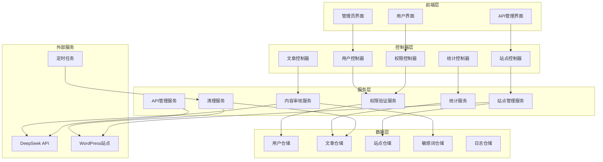

# 设计文档

## 概述

WordPress插件V2.0升级系统采用模块化架构设计，在现有基础系统上构建企业级多用户内容管理平台。系统核心围绕权限管理、多站点发布、内容审核和自动化运维四大功能模块，通过统一的API接口和事件驱动机制实现各模块间的松耦合协作。

设计遵循WordPress插件开发最佳实践，采用MVC架构模式，确保代码可维护性和扩展性。所有敏感数据采用AES-256-GCM加密算法进行存储，API密钥通过环境变量或wp-config.php常量管理，确保系统安全性符合企业级标准。

## 架构

### 系统架构图



### 核心设计原则

1. **单一职责原则**: 每个模块专注于特定功能领域
2. **开闭原则**: 系统对扩展开放，对修改封闭
3. **依赖倒置**: 高层模块不依赖低层模块，都依赖抽象
4. **接口隔离**: 客户端不应依赖它不需要的接口
5. **最小权限原则**: 用户和组件仅获得完成任务所需的最小权限

## 组件和接口

### 权限管理组件

**AuthenticationManager**
```php
interface AuthenticationManager {
    public function authenticate(string $username, string $password): ?User;
    public function getCurrentUser(): ?User;
    public function hasCapability(User $user, string $capability): bool;
    public function checkPermission(User $user, string $action, $resource): bool;
}
```

**RoleManager**
```php
interface RoleManager {
    public function createRole(string $roleName, array $capabilities): Role;
    public function assignRole(User $user, Role $role): void;
    public function getUserRoles(User $user): array;
    public function hasRole(User $user, string $roleName): bool;
}
```

### 文章管理组件

**ArticleManager**
```php
interface ArticleManager {
    public function createArticle(User $author, ArticleData $data): Article;
    public function updateArticle(Article $article, ArticleData $data, User $user): Article;
    public function deleteArticle(Article $article, User $user): bool;
    public function getArticlesByUser(User $user): array;
    public function changeStatus(Article $article, string $status, User $user): bool;
}
```

**ContentModerator**
```php
interface ContentModerator {
    public function moderateContent(string $content, ModerationLevel $level): ModerationResult;
    public function checkSensitiveWords(string $content): array;
    public function applyCensorship(string $content, CensorshipRule $rule): string;
}
```

### 站点管理组件

**SiteManager**
```php
interface SiteManager {
    public function addSite(SiteConfig $config): Site;
    public function updateSite(Site $site, SiteConfig $config): Site;
    public function deleteSite(Site $site): bool;
    public function testConnection(Site $site): ConnectionResult;
    public function publishToSite(Article $article, Site $site): PublishResult;
}
```

**WordPressBridge**
```php
interface WordPressBridge {
    public function authenticate(Site $site): bool;
    public function createPost(Site $site, PostData $data): int;
    public function updatePost(Site $site, int $postId, PostData $data): bool;
    public function deletePost(Site $site, int $postId): bool;
}
```

### API管理组件

**APIKeyManager**
```php
interface APIKeyManager {
    public function storeKey(string $service, string $key): void;
    public function getKey(string $service): ?string;
    public function validateKey(string $service, string $key): bool;
    public function getBalance(string $service): ?float;
}
```

**DeepSeekClient**
```php
interface DeepSeekClient {
    public function moderateText(string $text): ModerationResponse;
    public function getAccountBalance(): float;
    public function checkApiHealth(): bool;
}
```

### 清理和统计组件

**CleanupScheduler**
```php
interface CleanupScheduler {
    public function scheduleCleanup(int $daysThreshold): void;
    public function executeCleanup(): CleanupResult;
    public function getCleanupLogs(): array;
}
```

**StatisticsCollector**
```php
interface StatisticsCollector {
    public function getUserStats(User $user, DateRange $range): UserStats;
    public function getSystemStats(DateRange $range): SystemStats;
    public function exportStats(array $stats, string $format): string;
}
```

## 数据模型

### 用户相关模型

```php
class User {
    private int $id;
    private string $username;
    private string $email;
    private string $passwordHash;
    private Role $role;
    private DateTime $createdAt;
    private DateTime $lastLoginAt;
    private bool $isActive;
}

class Role {
    private int $id;
    private string $name;
    private array $capabilities;
    private string $description;
}
```

### 文章相关模型

```php
class Article {
    private int $id;
    private string $title;
    private string $content;
    private User $author;
    private ArticleStatus $status;
    private array $tags;
    private DateTime $createdAt;
    private DateTime $updatedAt;
    private ?DateTime $publishedAt;
    private array $sitePublications;
}

enum ArticleStatus {
    case DRAFT;
    case PENDING_REVIEW;
    case APPROVED;
    case PUBLISHED;
    case REJECTED;
    case ARCHIVED;
}
```

### 站点相关模型

```php
class Site {
    private int $id;
    private string $name;
    private string $url;
    private SiteCredentials $credentials;
    private int $defaultCategoryId;
    private bool $isActive;
    private DateTime $createdAt;
    private ?DateTime $lastSyncAt;
}

class SiteCredentials {
    private string $username;
    private string $encryptedPassword;
    private ?string $encryptedApiKey;
    private string $authMethod; // 'password' or 'api_key'
}
```

### 审核相关模型

```php
class SensitiveWord {
    private int $id;
    private string $word;
    private WordType $type;
    private string $replacement;
    private bool $isBuiltIn;
    private DateTime $createdAt;
}

enum WordType {
    case HIGH_RISK;
    case NORMAL;
}

enum ModerationLevel {
    case LOOSE;
    case DEFAULT;
    case STRICT;
}
```

### 统计相关模型

```php
class UserStats {
    private User $user;
    private int $totalSubmissions;
    private int $approvedCount;
    private int $rejectedCount;
    private int $blockedByFilter;
    private DateRange $period;
}

class SystemStats {
    private int $totalUsers;
    private int $totalArticles;
    private int $totalSites;
    private array $userStats;
    private DateRange $period;
}
```

## 错误处理

### 异常层次结构

```php
abstract class PluginException extends Exception {
    protected string $errorCode;
    protected array $context;
}

class AuthenticationException extends PluginException {}
class AuthorizationException extends PluginException {}
class ValidationException extends PluginException {}
class ExternalServiceException extends PluginException {}
class DataIntegrityException extends PluginException {}
```

### 错误处理策略

1. **输入验证错误**: 返回详细的验证错误信息，指导用户修正
2. **权限错误**: 记录安全日志，返回通用权限不足消息
3. **外部服务错误**: 实现重试机制，降级处理，记录详细错误日志
4. **数据完整性错误**: 回滚事务，记录错误日志，通知管理员
5. **系统错误**: 记录完整错误堆栈，返回通用系统错误消息

### 错误恢复机制

- **API调用失败**: 实现指数退避重试，最多3次
- **数据库连接失败**: 使用连接池，自动重连
- **文件操作失败**: 检查权限，创建备份
- **外部站点发布失败**: 标记为待重试，定时重新发布

## 测试策略

### 单元测试

**测试覆盖范围**:
- 所有业务逻辑方法
- 数据验证和转换逻辑
- 权限检查逻辑
- 错误处理路径

**测试工具**: PHPUnit 9.x
**覆盖率目标**: 最低80%

### 集成测试

**测试场景**:
- 用户认证和授权流程
- 文章发布到WordPress站点
- DeepSeek API集成
- 数据库事务完整性

### 端到端测试

**测试用例**:
- 完整的文章发布流程
- 用户权限管理流程
- 多站点管理流程
- 自动清理流程

### 性能测试

**测试指标**:
- API响应时间 < 200ms
- 数据库查询优化
- 内存使用监控
- 并发用户支持

### 安全测试

**测试项目**:
- SQL注入防护
- XSS攻击防护
- CSRF令牌验证
- 权限绕过测试
- 敏感数据加密验证

## 正确性属性

*属性是应该在系统所有有效执行中保持为真的特征或行为——本质上是关于系统应该做什么的正式声明。属性作为人类可读规范和机器可验证正确性保证之间的桥梁。*

### 属性 1: 用户角色分配一致性
*对于任何*用户创建操作，创建后的用户应当具有指定的角色，且该角色的权限应当立即生效
**验证: 需求 1.1**

### 属性 2: 权限访问控制
*对于任何*普通用户和管理员功能，普通用户的访问尝试应当被拒绝，而管理员用户的访问应当被允许
**验证: 需求 1.2, 1.5**

### 属性 3: 操作权限验证
*对于任何*用户操作，系统应当在执行前验证用户身份和操作权限
**验证: 需求 1.3**

### 属性 4: 文章数据隔离
*对于任何*普通用户，其文章列表查询结果应当仅包含该用户创建的文章，不包含其他用户的文章
**验证: 需求 1.4**

### 属性 5: 文章状态管理
*对于任何*普通用户创建的文章，其初始状态应当为"待审核"，且只有管理员能够将其状态修改为"已发布"或"已拒绝"
**验证: 需求 2.1, 2.3**

### 属性 6: 文章访问权限控制
*对于任何*用户和文章，用户只能编辑和删除自己创建的文章，尝试操作他人文章应当被拒绝
**验证: 需求 2.2, 2.5**

### 属性 7: 站点配置安全性
*对于任何*站点配置操作，添加站点时应当验证连接性，认证信息应当加密存储，删除时应当检查关联数据
**验证: 需求 3.1, 3.5**

### 属性 8: WordPress同步一致性
*对于任何*文章发布或删除操作，本地数据库的变更应当同步反映到对应的WordPress站点上
**验证: 需求 3.3, 5.3**

### 属性 9: API密钥安全管理
*对于任何*API密钥存储操作，密钥应当以加密形式存储，且系统应当能够验证密钥有效性和查询余额
**验证: 需求 4.1, 4.2**

### 属性 10: 系统错误恢复
*对于任何*外部服务调用失败，系统应当记录错误信息并继续其他功能的正常运行
**验证: 需求 4.3**

### 属性 11: 清理任务配置应用
*对于任何*清理阈值配置，设置后应当立即应用于后续的自动和手动清理任务
**验证: 需求 5.1**

### 属性 12: 文章清理识别
*对于任何*清理任务执行，系统应当准确识别超过配置阈值天数的文章并执行删除
**验证: 需求 5.2**

### 属性 13: 清理操作日志记录
*对于任何*清理操作，系统应当记录包含时间、标题和站点信息的完整删除日志
**验证: 需求 5.4**

### 属性 14: 统计数据准确性
*对于任何*统计报表生成，应当包含准确的总提交数、审核通过数和敏感词拦截数，且支持时间范围查询
**验证: 需求 6.2, 6.5**

### 属性 15: 数据导出格式
*对于任何*统计数据导出操作，生成的CSV文件应当包含所有必要的统计信息且格式正确
**验证: 需求 6.3**

### 属性 16: 统计实时更新
*对于任何*新的文章提交或状态变更，统计数据应当实时反映最新的发布情况
**验证: 需求 6.4**

### 属性 17: 审核等级行为一致性
*对于任何*内容审核操作，系统应当根据当前配置的审核等级（宽松/默认/严格）执行相应的处理策略
**验证: 需求 7.1, 7.2, 7.3, 7.5**

### 属性 18: 审核配置热更新
*对于任何*审核等级修改，新规则应当立即生效并应用于后续的内容审核，无需系统重启
**验证: 需求 7.4**

### 属性 19: 敏感词管理功能
*对于任何*敏感词添加、导入或搜索操作，系统应当正确处理词汇类型、验证文件格式并支持模糊匹配
**验证: 需求 8.3, 8.4, 8.5**

### 属性 20: 向后兼容性保持
*对于任何*现有敏感词屏蔽功能的使用，系统升级后应当保持原有行为不变
**验证: 需求 9.1**

### 属性 21: 错误信息提供
*对于任何*操作失败情况，系统应当提供明确的错误信息和解决建议
**验证: 需求 9.5**

### 属性 22: 审计日志完整性
*对于任何*关键操作（权限修改、配置变更、清理执行、异常发生），系统应当记录包含操作人、时间和详细内容的审计日志
**验证: 需求 10.1, 10.2, 10.3, 10.4, 10.5**